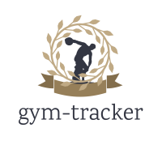

# ioBroker.gym-tracker

**Tests:** 

## gym-tracker adapter for ioBroker

This adapter loads the current capacity utilization of fitness studios of different companies into  ioBroker.

This way the utilization can be f.e. integrated into iobroker VIS or send to your phone by telegram.

## Changelog
<!--
    Placeholder for the next version (at the beginning of the line):
    ### **WORK IN PROGRESS**
-->

### 0.1.5-2 (2021-08-16)
* (jlssmt) change state folder structure from studio id to name 

### 0.1.5-1 (2021-08-16)
* (jlssmt) added logo

### 0.1.5-0 (2021-08-16)
* (jlssmt) added translations

### 0.1.4-0 (2021-08-16)
* (jlssmt) bug fixing

### 0.1.3 (2021-08-16)
* (jlssmt) bug fixing

### 0.1.2 (2021-08-16)
* (jlssmt) production bug fixing

### 0.1.1 (2021-08-15)
* (jlssmt) initial release

### 0.1.0 (2021-08-15)
* (jlssmt) base implementation

## License
MIT License

Copyright (c) 2021 jlssmt <i-hate-spammers-emails-wont-be-read@gmail.com>

Permission is hereby granted, free of charge, to any person obtaining a copy
of this software and associated documentation files (the "Software"), to deal
in the Software without restriction, including without limitation the rights
to use, copy, modify, merge, publish, distribute, sublicense, and/or sell
copies of the Software, and to permit persons to whom the Software is
furnished to do so, subject to the following conditions:

The above copyright notice and this permission notice shall be included in all
copies or substantial portions of the Software.

THE SOFTWARE IS PROVIDED "AS IS", WITHOUT WARRANTY OF ANY KIND, EXPRESS OR
IMPLIED, INCLUDING BUT NOT LIMITED TO THE WARRANTIES OF MERCHANTABILITY,
FITNESS FOR A PARTICULAR PURPOSE AND NONINFRINGEMENT. IN NO EVENT SHALL THE
AUTHORS OR COPYRIGHT HOLDERS BE LIABLE FOR ANY CLAIM, DAMAGES OR OTHER
LIABILITY, WHETHER IN AN ACTION OF CONTRACT, TORT OR OTHERWISE, ARISING FROM,
OUT OF OR IN CONNECTION WITH THE SOFTWARE OR THE USE OR OTHER DEALINGS IN THE
SOFTWARE.
